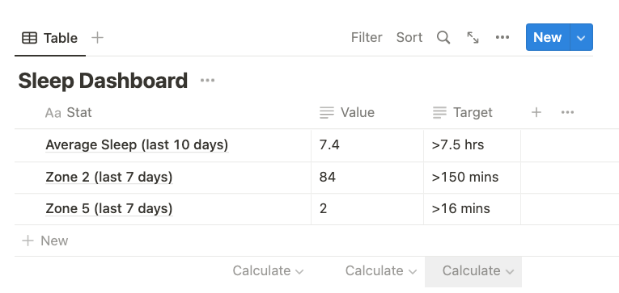

# WHOOP Dashboard in Notion
This project displays the following statistics from WHOOP in a Notion database:

1. Average sleep over the last 10 nights (doesn't include naps)
2. Total Zone 2 cardio over the last 7 days
3. Total Zone 5 cardio over the last 7 days

# Steps to running the project
1. Create a Firebase project with the Blaze pricing plan to enable Cloud Functions.
2. Get your WHOOP client ID and client secret by [setting up your developer account](https://developer.whoop.com/). You'll need a WHOOP membership & band to use the API. Set the redirect URI of your project to https://aamir.me/ for less code modification later (or any other URL you want - it doesn't matter for the purposes of the project)
3. Obtain your Notion integration secret and database ID by [setting up a private Notion integration](https://developers.notion.com/) for the database in your Notion workspace that you'd like to display the statistics in.
4. Set these API credentials as environment variables on your local machine. Name them `WHOOP_CLIENT_ID`, `WHOOP_CLIENT_SECRET`, `NOTION_INTEGRATION_SECRET`, and `NOTION_DATABASE_ID`.
5. Create a python 3.8+ virtual environment named `venv` inside `functions/` and `pip install -r requirements.txt`. Keep the virtual environment activated.
6. Navigate to the root directory of the project and run `testing/get_new_tokens.py`. You may need to adjust the redirect URI in this file to match the one you provided to WHOOP. Follow the scripts prompts to obtain your WHOOP access and refresh tokens. Set them as environment variables named `WHOOP_ACCESS_TOKEN` and `WHOOP_REFRESH_TOKEN`. Note that the access token expires after about an hour, so if you're unable to deploy the Firebase Cloud Functions by then, you'll need to repeat this step later to get new tokens.
7. Install the `firebase` and `gcloud` CLIs.
8. Run `firebase init` in the root directory of the project and follow the steps to connect the repo to your Firebase project.
9. Set `WHOOP_CLIENT_ID`, `WHOOP_CLIENT_SECRET`, `NOTION_INTEGRATION_SECRET`, `NOTION_DATABASE_ID`, `WHOOP_ACCESS_TOKEN`, and `WHOOP_REFRESH_TOKEN` as secrets using `firebase functions:secrets:set SECRET_NAME`. You'll need to repeat this step for the access and refresh tokens if they expire before you can deploy the cloud functions.
10. Run `firebase deploy --only function` to deploy the Firebase Cloud Functions. When the deploy is successful, you should see an endpoint for the whoop_webhook() function displayed in your terminal. Navigate back to the WHOOP developer dashboard and enter this value as the webhook for your project.
11. If you've set up everything correctly, your Notion database should update whenever WHOOP detects a new sleep or workout, and once a day around 11:35pm.

# How this project works 
At a high level, data flows from WHOOP to the deployed Firebase Cloud Functions to Notion.

More specifically: 
1. WHOOP triggers a webhook (implemented in this repo as a Firebase Cloud Function) whenever a workout or 
sleep activity is detected. 
2. The Firebase Cloud function queries the WHOOP API for the required data and calculates the 
desired statistics.
3. The function then pings the Notion API to write the statistics into a Notion database.
4. This process is also triggered by the daily reconciliation function (implemented as a scheduled Firebase Cloud Function).
5. Finally, another cloud function runs every 45 minutes to refresh the WHOOP access token.

# Tour of the repo contents
`testing` contains useful files to test the APIs used in the project.

`functions/main.py` contains the Firebase Cloud Functions.

`functions/helpers` is a local package that contains two helper files, `notion.py` and `whoop.py`. All code
that interacts with each of WHOOP's and Notion's API is contained in these files.